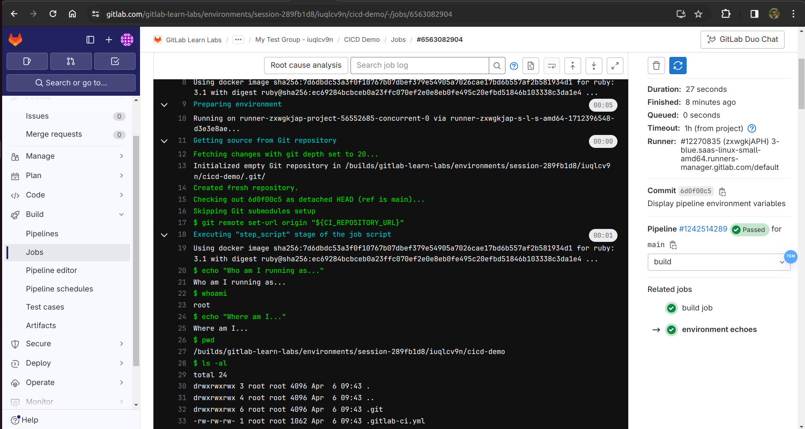

# GitLab CI/CD - Hands-On Lab: Display Pipeline Info
This Hands-On Guide walks you through the lab exercises in the GitLab CI/CD course.
Estimate time to complete: 15 - 20 minutes

We are transitioning to the latest version of this course. If your group URL starts with https://spt.gitlabtraining.cloud, please use the Version 15.x instructions.

Objectives
When a job is executed in a pipeline, it runs inside of an environment. To ensure that environments are set up to run a job successfully, a pipeline defines various environment variables. In this lab, you will learn how to display the environment variables for your pipeline.

Task A. Viewing your Environment Variables
Open your CICD Demo project from previous labs.

Click on your .gitlab-ci.yml file to view its contents. To edit the file, click Edit > Edit single file.

Paste the contents of the following snippet at the bottom of .gitlab-ci.yml. There should be am empty line between the file’s previous content and the pasted snippet content.

environment echoes:
  stage: build
  script:
    - echo "Who am I running as..."
    - whoami
    - echo "Where am I..."
    - pwd
    - ls -al
    - echo "Here's what is available in our environment..."
    - env
After pasting the contents, your .gitlab-ci.yml file will look like this:

stages:
  - test
  - build

test job:
  stage: test
  script:
    - echo "I am a unit test!"

build job:
  stage: build
  script:
    - echo "I am a build image!"

environment echoes:
  stage: build
  script:
    - echo "Who am I running as..."
    - whoami
    - echo "Where am I..."
    - pwd
    - ls -al
    - echo "Here's what is available in our environment..."
    - env
In the Commit message field, type Display pipeline environment variables, and set the Target Branch to main

Click the Commit changes button.

In the left-hand navigation pane, click Build > Pipelines. The pipeline that was started when you committed changes is represented by the first row in that table.

After the pipeline completes, click the status icon at the left of the first row to see the pipeline’s jobs. Click the environment echoes job and review its output to see the environment variables on the runner.

