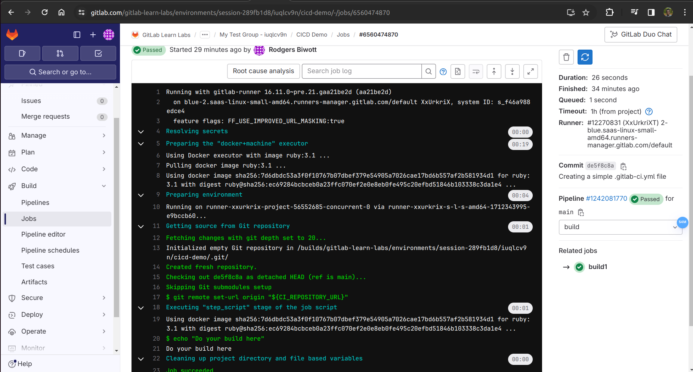

# GitLab CI/CD - Hands-On Lab: Defining Stages, Jobs, and Runners
This Hands-On Guide walks you through the lab exercises in the GitLab CI/CD course.
Estimate time to complete: 15 - 20 minutes

We are transitioning to the latest version of this course. If your group URL starts with https://spt.gitlabtraining.cloud, please use the Version 15.x instructions.

Objectives
In this lab, you’ll enabled CI/CD for a GitLab project. After creating your first .gitlab-ci.yml file, you will explore the CI/CD pipeline to better understand jobs and stages. Finally, you will learn how to install, run, and register a runner with a GitLab instance.

Note: Parts D through F in this exercise require admin rights to your local machine. If you are unable to install GitLab Runner locally, you may skip parts D through F and use the training environment’s shared runners instead.

# Task A. Log into GitLab and create a project
Navigate to https://gitlabdemo.com/invite in a web browser.

In the Invitation Code field, enter the invitation code provided by your instructor or in the LevelUp LMS.

Select Provision Training Environment.

The system then prompts you for your GitLab.com username. Enter your GitLab.com user in the field provided. Click Provision Training Environment.

On the confirmation page, locate the Your GitLab Credentials section. Read this section carefully, noting the credential information provided and the expiration date. Your access to this group and all of the projects that you create is ephemeral and will be deleted after the expiration date.

Select My Group at the bottom of the page.

Sign in with your existing GitLab.com credentials.

You will be redirected to a My Test Group group that provides a sandbox for you to perform training lab steps in.

Note: This group has a GitLab Ultimate license to see all of the features while your personal username namespace requires a paid subscription or a free trial to access all of the features.

From the My Test Group training subgroup, click the New project button.

Click the Create blank project tile.

In the Project name text box, enter CICD Demo.

Note: The project slug will automatically populate. You can change this to a shorter string if desired for your own project. Leave it at the default for this lab.

In the Project URL field, click the dropdown for the second half of the URL to make sure it’s pointing to a group name (starts with gitlab-learn-labs/*) and not a username. You should create this project inside a group, not directly in your user’s namespace.

Under Visibility Level, ensure Private is selected.

Note: Since the parent group above your group is private, all child groups and projects below will be private. You can learn more about project visibility levels in the documentation.

Check Initialize repository with a README.

Ensure that the Enable Static Application Security Testing (SAST) checkbox remains unchecked.

Click the Create project button.

# Task B. Add a .gitlab-ci.yml File
To use GitLab CI/CD, you start with a .gitlab-ci.yml file at the root of your project. The .gitlab-ci.yml file contains the configurations for your CI/CD pipeline. In this section, you will create a simple gitlab-ci.yml file.

Create a new file in the main branch by clicking (+) > This directory > New file.

In the Filename field, type .gitlab-ci.yml

Select the Bash template from the Apply a template dropdown. This will pre-populate the file.

To create a minimal .gitlab-ci.yml file:

Delete all lines above build1.
Delete all lines below echo "For example run a test suite" in the test1 section.
Add build and test stages by pasting these lines at the top of the file.

stages:
  - build
  - test
Note: Keep in mind that YAML files should be indented with two spaces. Your web IDE may try to use a tab with 4 spaces. Simply use the backspace to set 2 spaces if you are not copying and pasting the examples.

Set the commit message to Creating a simple .gitlab-ci.yml file, and set the Target Branch to main.

Click Commit changes.

After committing the changes, you will have a .gitlab-ci.yml that looks like this:

stages:
- build
- test

build1:
  stage: build
  script:
    - echo "Do your build here"

test1:
    stage: test
    script:
        - echo "Do a test here"
        - echo "For example run a test suite"
This file defines two stages: build and test. The build1 job executes during the build stage, running all of the commands in script. The test1 job executes during the test stage, running all of the commands in script.

# Task C. View a Pipeline’s Status, Stages, Jobs, and GitLab Runner
When you commit your .gitlab-ci.yml file, a pipeline is created. A pipeline comprises of jobs and stages. In the previous section, you defined two stages: build and test. Each of these stages contained jobs, which were defined in script. In this section, you will view the pipeline created from your .gitlab-ci.yml file.

In the left navigation pane, click Build > Pipelines to see an overview of all pipelines. The top row in the overview shows the pipeline that started a few seconds ago, when you committed .gitlab-ci.yml. The status icon at the left of the row should say either running or passed.

Click the status icon of the top row to see the details of the most recent pipeline. You’ll see columns representing the pipeline’s stages, and widgets representing jobs within each stage.

Note: The order of execution for stages generally reads left to right. In this example, the build stage is the leftmost column, since it is the first stage to execute.

Click each of the two jobs to see the output in a web terminal. Identify the gitlab-runner for each job

Hint: it’s listed near the top of each job’s output.

